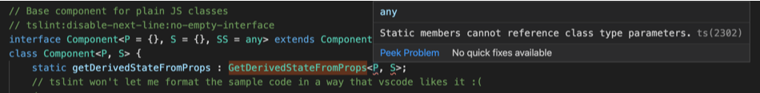

#  typescript 静态方法的范型


### 故事背景

在维护一个 react 老旧项目时，store 中的状态必须清空后才能重新加载（不是我的代码😂），但是在页面中显示时体验会非常差，造成切换时数据立马消失和页面抖动。现在就要在不重构 store 的前提下来优化这个问题（有风险，不想现在重构😈）。最近刚更新了 react 版本，所以决定试试 react 的新生命周期`getDerivedStateFromProps`，通过派生状态来优化前端的显示。（在使用派生状态之前，[你可能不需要使用派生状态](https://zh-hans.reactjs.org/blog/2018/06/07/you-probably-dont-need-derived-state.html)）

### 实现

```js
import React from 'react'

type IProps = {
  data: number[]
}

export default class SomeComponent extends React.Component<IProps> {
  state = {
    data: []
  }

  static getDerivedStateFromProps(props) {
    if(props.data.length) {
      return props.data
    }
    return null
  }

  render() {
    const { data } = this.state

    return (
      <ul>
        {data.map((val, index) => { <li key={index}>{val}</li> })}
      </ul>
    )
  }
}

```

实现的时候发现了几个问题：

1. 为什么没有 `getDerivedStateFromProps` 的语法提示，编辑器 bug 了？

2. 写完之后 `props` 的类型检查居然报错，但我不是在 component 上定义了 `IProps` 了么，typescript bug 了？


### 探索

决定顺手去翻下 `@type/react` 中相关的类型定义，看下问题在哪。

```js
interface Component<P = {}, S = {}, SS = any> extends ComponentLifecycle<P, S, SS> { }

class Component<P, S> {
    static contextType?: Context<any>;
    context: any;
    constructor(props: Readonly<P>);
    constructor(props: P, context?: any);
    setState<K extends keyof S>(
        state: ((prevState: Readonly<S>, props: Readonly<P>) => (Pick<S, K> | S | null)) | (Pick<S, K> | S | null),
        callback?: () => void
    ): void;
    forceUpdate(callback?: () => void): void;
    render(): ReactNode;
    readonly props: Readonly<P> & Readonly<{ children?: ReactNode }>;
    state: Readonly<S>;
    refs: {
        [key: string]: ReactInstance
    };
}

interface ComponentLifecycle<P, S, SS = any> extends NewLifecycle<P, S, SS>, DeprecatedLifecycle<P, S> {
    componentDidMount?(): void;
    shouldComponentUpdate?(nextProps: Readonly<P>, nextState: Readonly<S>, nextContext: any): boolean;
    componentWillUnmount?(): void;
    componentDidCatch?(error: Error, errorInfo: ErrorInfo): void;
}

interface NewLifecycle<P, S, SS> {
    getSnapshotBeforeUpdate?(prevProps: Readonly<P>, prevState: Readonly<S>): SS | null;
    componentDidUpdate?(prevProps: Readonly<P>, prevState: Readonly<S>, snapshot?: SS): void;
}
```

wtf？你会发现这一连串定义中完全没有 `getDerivedStateFromProps` 的身影，那么它的定义在哪呢？

```js
// Unfortunately, we have no way of declaring that the component constructor must implement this
interface StaticLifecycle<P, S> {
    getDerivedStateFromProps?: GetDerivedStateFromProps<P, S>;
    getDerivedStateFromError?: GetDerivedStateFromError<P, S>;
}

type GetDerivedStateFromProps<P, S> = (nextProps: Readonly<P>, prevState: S) => Partial<S> | null;
```

我们没法实现需求！！！😂 but why？不要相信程序员的接口，让我改改试试。

### 修改

尝试了两个办法：

1. `Component` 直接 extends `StaticLifecycle`

```js
interface Component<P = {}, S = {}, SS = any> extends ComponentLifecycle<P, S, SS>, StaticLifecycle<P,S> { }
```

这么改完之后编辑器了有提示了，但等等，它不是静态方法，变成实例方法了。因为 `StaticLifecycle` 中的定义不是 `static` 。

2. `Component` 中直接定义 `getDerivedStateFromProps`

```js
class Component<P, S> {
    static getDerivedStateFromProps : GetDerivedStateFromProps<P, S>;
    ...
}
```

类型报错，这也是为什么 `props` 的类型检查报错，说没有显示定义 `any`，而没有自动推断出类型为 `IProps` 的原因。（更多关于这个报错的讨论 [Typescript issue 24018](https://github.com/Microsoft/TypeScript/issues/24018)）



我的探索就暂时到此结素，看来还是真是没办法实现😂。

### 更多的问题

`StaticLifecycle` 既然没有用在 Component 中，那它的定义有什么用？
