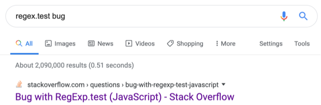
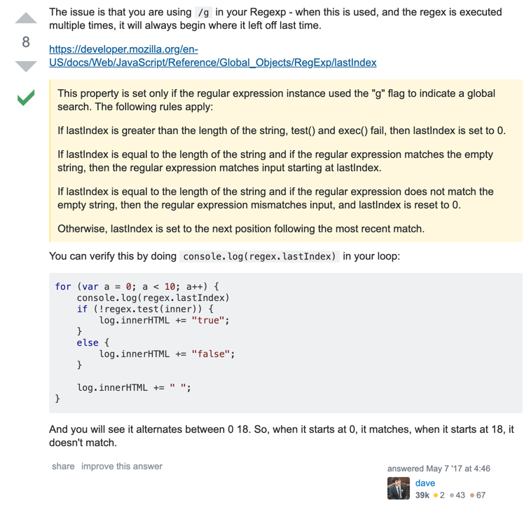

# 注意：regex.test 不是一个纯函数

### 问题

regex.test 不是一个纯函数，我可能一直不会注意到这一点，直到我被这个问题坑了一晚上。

本来写一个正则表达式的 validator

```js
function validator (pattern, message) {
  return function (value) {
    return !pattern.test(value) && message
  }
}
```

调用
```js
const nameRegex = /(\d|\w|_|-){5,20}/g

console.log(validator(nameRegex, '请输入正确的名字')('aaa') )
console.log(validator(nameRegex, '请输入正确的名字')('aaaaa'))
console.log(validator(nameRegex, '请输入正确的名字')('aaaaaa'))
console.log(validator(nameRegex, '请输入正确的名字')('aaaaaaa'))
```

猜猜输出结果，wtf
```
请输入正确的名字
false
请输入正确的名字
false
```

更直接一点，直接调用正则表达式的 test 方法
```js
console.log(nameRegex.test('aaa')) 
console.log(nameRegex.test('aaaaa'))
console.log(nameRegex.test('aaaaaa'))
console.log(nameRegex.test('aaaaaaa'))
```

输出
```
false
true
false
true
```

当时的场景下，一度严重怀疑是使用的库 bug 了或是我的正则写错了，debug 了一晚上，最后居然震惊地发现居然是 regex.test 返回的结果不一致。那么这是怎么回事呢？ google 一下





简单地说，当加上了 `g` `global` 这个 flag 之后，每次调用 test 会记录下 lastIndex 的值，下次调用时会从这个 lastIndex 开始搜索。而且当 test 失败时，lastIndex 会重置会 0。

再来分析下我写的 bug

```js
console.log('lastIndex:', nameRegex.lastIndex) // 0
console.log('result:', nameRegex.test('aaa')) // false
console.log('lastIndex:', nameRegex.lastIndex) // 0
console.log('result:', nameRegex.test('aaaaa')) // true
console.log('lastIndex:', nameRegex.lastIndex) // 5
console.log('result:', nameRegex.test('aaaaaa')) // false
console.log('lastIndex:', nameRegex.lastIndex) // true
console.log('result:', nameRegex.test('aaaaaaa')) // true
console.log('lastIndex:', nameRegex.lastIndex) // 7
```

前面两次调用 `lastIndex` 都从 0 开始，所以都和期望一致。因为第二次调用成功了, `lastIndex` 设为 5。接下来的字符串从位置 5 开始比较，相当于长度只有 1，所以返回 `false`，`lastIndex` 又被重置回 0，再次调用时又和期望一致。如此导致了结果一直跳动的奇怪现象。

### 解决

去掉 g flag 就可以了，因为写 `string replace` 的时候习惯写 g 了，所以这里写 g 就被坑了。

当然作为一个通用验证函数，为了避免更多人被坑，我改成了用 string.match。

```js
function validator (pattern, message) {
  return function (value) {
    return !value.match(pattern) && message
  }
}
```

### 参考

[stackoverflow](https://stackoverflow.com/questions/43827851/bug-with-regexp-test-javascript)

[MDN regexp.lastIndex](https://developer.mozilla.org/en-US/docs/Web/JavaScript/Reference/Global_Objects/RegExp/lastIndex)

